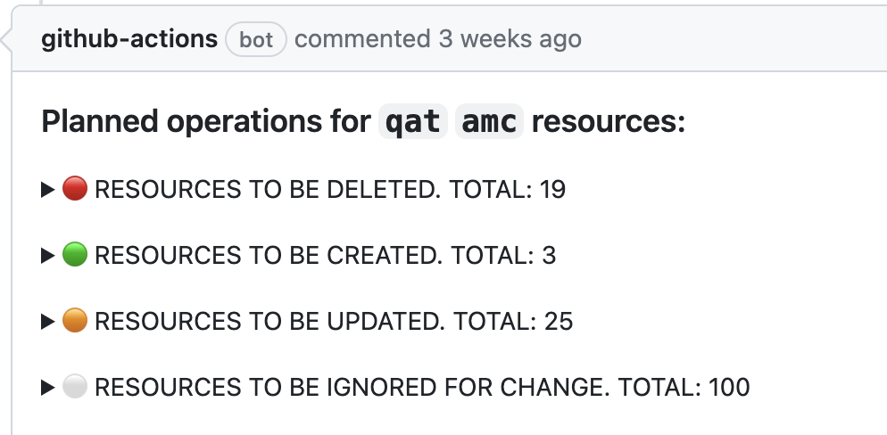

# Terraform plan reporter
This tool is a report builder of what the infrastructure changes are planned to be done, based on terraform binary plan files. Pay attention that under the hood it uses the command `terraform  show -json -no-color` - it only operates with json formatted of terraform plans and it is not be able to work with binary plan files directly. It is supposed to use it as auxillary tool inside a CI/CD pipeline (or workflow, in Github term).

## Use case
The most relevant use case of this tool is when the infrastructure is build with help of tandem of `terragrunt` and `terraform` tools. Therefore, it's not so rare situation when to change of already existing installation or to deploy a new one, it's required to run few terragrunt and terraform modules. This run can produce of few terraform binary plan files, which might be analyzed by plan reporter.

For example, let's imagine that our infrastructure is based on Azure cloud and build by following list of terragrunt modules:
* `resource-groups` - manages resource groups
* `storage-accounts` - manages storage accounts, containers, queues, tables. Depends on `resource-groups` module.
* `function-apps` - manages function apps. Depends on `resource-groups`, `storage-accounts` modules.
* `datafactories` - manages data factories. Depends on `resource-groups` module.
* `key-vaults` - manages key vaults. Depends on `resource-groups`, `function-apps`, `datafactories` modules.

Each of this terragrunt module has corresponding terraform module, respectively: `az-resource-groups`, `az-storage-accounts`, `az-function-apps`, `az-datafactories`, `az-key-vaults`

Now it's time to create the infrastructure, containing all of these components, from scratch, or to do some changes in already existing one. Once all input data for the infrastructure is prepared/updated, then the following command might be launched, in the folder where all these terragrunt modules are located:

```bash
> ls -l1 .
resource-groups
storage-accounts
function-apps
datafactories
key-vaults

> terragrunt plan-all --terragrunt-non-interactive -out=tfplan.bin -lock=false
...
```

If `terragrunt plan-all` command succeeds, then the following list of terraform plan files are created:

```bash
> find . -name tfplan.bin
resource-groups/.terragrunt-cache/xxxxxxxxxxxxxxxxxxxxxxxxxxx/yyyyyyyyyyyyyyyyyyyyyyyyyyyy/az-resource-groups/tf_plan.bin
storage-accounts/.terragrunt-cache/xxxxxxxxxxxxxxxxxxxxxxxxxxx/yyyyyyyyyyyyyyyyyyyyyyyyyyyy/az-storage-accounts/tf_plan.bin
function-apps/.terragrunt-cache/xxxxxxxxxxxxxxxxxxxxxxxxxxx/yyyyyyyyyyyyyyyyyyyyyyyyyyyy/az-function-apps/tf_plan.bin
datafactories/.terragrunt-cache/xxxxxxxxxxxxxxxxxxxxxxxxxxx/yyyyyyyyyyyyyyyyyyyyyyyyyyyy/az-datafactories/tf_plan.bin
key-vaults/.terragrunt-cache/xxxxxxxxxxxxxxxxxxxxxxxxxxx/yyyyyyyyyyyyyyyyyyyyyyyyyyyy/az-key-vaults/tf_plan.bin
```

All these files are targets for `terragrunt plan reporter` tool. If it would process them, then the changes report is printed to stdout or/and specified output markdown file, which might be uploaded as GitHub comment of a pull request or an issue, for example: .

If there is even 1 critical resource, which is planned to be deleted, according to generated plan files, `terragrunt plan reporter` after printing the result might finish with non 0 return code, to prevent further pipeline/workflow run.

## How to build
To be able to build the app, on your local machine, it's required to have installed `mage` tool, or build it with help of following command:
```bash
> go install github.com/magefile/mage
```

Then it might be build:
```bash
> mage
Building of 'tf-plan-reporter' ...
```

Or there is other way is to download of already built artefact from Github, but only for Linux OS (ubuntu-latest image for specified date)

## How to use
`terragrunt plan reporter` has the following CLI arguments:
```bash
./tf-plan-reporter --help
Usage of ./tf-plan-reporter:
      --config-file string   Config file name of the App
      --keep-gate            Finish App with non zero exit code if critical resources removals are detected
      --no-color             Turn off color output in log messages
      --print-example        Print an example of the App config file without analyses run
      --report-file string   Output file name of the report
      --verbose              Add debug logging output
```

## Config file
The example config files might be printed with help of usage `--print-example` CLI flag. The config file and its help looks following way:
```yaml
#tf-plan-reporter tool example config file
terraform_binary_file: /usr/bin/terraform     # Absolute or relative path of terraform command. MANDATORY parameter
terraform_plan_file_basename: plan.bin        # Base name of terraform binary file for further search. MANDATORY parameter
terraform_plan_search_folder: .               # Common parent folder from which to start search of generated plan files. MANDATORY parameter

# List of cloud resources which should be kept. Must be either "all" and then the "allowed_removals" section of this file
# is going to payed attention. Or it should contain particular type of resources which should be kept from accidental removals. OPTIONAL parameter
critical_resources:
  - all

allowed_removals:                             # Makes sense only if "all" item is specified in "critical_resources" section. OPTIONAL parameter
  - null_resource
  - azurerm_role_assignment
  - azurerm_monitor_diagnostic_setting
  - azurerm_key_vault
```
